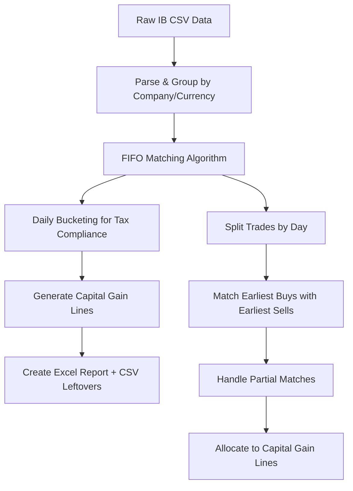

# Investment Reporting Tool

## Overview

The investment reporting tool is designed to provide a simple and efficient way to generate capital gains data for tax reporting purposes. The tool can be used for reporting in various countries with similar requirements of grouping bought/sold investments.

**Current Capabilities:**
- ✅ **Share Trading**: Processes Interactive Brokers CSV reports for stock trading
- ✅ **Capital Gains Calculation**: FIFO-based matching of buy/sell transactions within daily buckets
- ✅ **Capital Gains Reporting**: Generates Excel reports with capital gains data for tax authority submission
- ✅ **Dividend Income Reporting**: Processes dividend data and generates detailed dividend income reports
- ✅ **Multi-Currency Support**: Handles multiple currencies with manual exchange rate configuration

**Future Vision:**
- 🚀 **Additional Investment Types**: Support for crypto currency trading, DeFi protocols, staking rewards, and other investment vehicles
- 🚀 **Multiple Data Sources**: Integration with crypto exchanges (Binance, Coinbase, Kraken), DeFi platforms, and other financial APIs
- 🚀 **Advanced Matching**: Sophisticated algorithms for different investment types and tax optimization strategies
- 🚀 **Automated Exchange Rates**: Real-time currency conversion from multiple financial data providers

## Architecture & Design Philosophy

This project follows **Clean Architecture** principles with **Domain-Driven Design** and professional Python package structure. The architecture is designed to be extensible for future investment types and data sources.

### **Layered Architecture**
- **Domain Layer** (`src/shares_reporting/domain/`): Core business entities and rules (investment-agnostic)
- **Application Layer** (`src/shares_reporting/application/`): Business logic and orchestration
- **Infrastructure Layer** (`src/shares_reporting/infrastructure/`): External concerns (config, APIs, data sources)
- **Presentation Layer** (`src/shares_reporting/main.py`): Application entry point

### **Extensibility Design**
The clean architecture ensures that adding new investment types and data sources requires minimal changes:
- **New Investment Types**: Add domain entities and application services without affecting existing code
- **New Data Sources**: Implement new extraction adapters in the infrastructure layer
- **New Capital Gains Rules**: Extend transformation logic with country-specific capital gains calculations

### **Professional Package Structure**
```
src/shares_reporting/
├── domain/                    # Domain Layer (investment-agnostic)
│   ├── value_objects.py       # TradeDate, Currency, Company, TradeType
│   ├── entities.py            # TradeAction, TradeCycle, CapitalGainLine
│   ├── accumulators.py        # CapitalGainLineAccumulator, TradePartsWithinDay
│   └── collections.py         # Type aliases and collections
├── application/               # Application Layer
│   ├── extraction.py          # Data parsing (currently CSV, extensible to APIs)
│   ├── transformation.py      # Investment calculations and matching
│   └── persisting.py          # Report generation (Excel, CSV, future formats)
├── infrastructure/             # Infrastructure Layer
│   └── config.py              # Configuration and external service management
└── main.py                    # Application entry point
```

The initial implementation has been **refactored** from a flat structure to a professional modular architecture while maintaining the same business functionality and backward compatibility. This architecture prepares the codebase for future expansion into multiple investment types and data sources.

# Table of Contents
- [Prerequisites](#prerequisites)
- [Modules](#modules)
- [Usage](#usage)
- [Roadmap & Future Development](#roadmap--future-development)
- [Debugging](#debugging)
- [Additional Practice](#additional-practice)
- [Feedback](#feedback) - Please create issues to provide feedback!


## Prerequisites
### **Update source files**
  - **Current**: Add Interactive Brokers CSV file to `/resources/source` folder. See `/resources/shares_example.csv` for an example of the file format.
  - **Future**: Additional data sources will be supported (crypto exchanges, DeFi platforms, etc.)
  - Update config.ini with all required currency exchange pairs.
    E.g. you can use the exchange rates from the last day of the year from your national central bank or financial institution 

### Setting Up Development Environment

#### **Option 1: Using Poetry (Recommended)**

Poetry provides modern dependency management and virtual environment handling.

**Step 1: Install Poetry**
```bash
# For macOS/Linux
curl -sSL https://install.python-poetry.org | python3 -

# For Windows (PowerShell)
(Invoke-WebRequest -Uri https://install.python-poetry.org -UseBasicParsing).Content | python3 -

# Or via pip (less recommended)
pip install poetry
```

**Step 2: Install Dependencies**
```bash
cd shares-reporting
poetry install
```

**Step 3: Activate Virtual Environment**
```bash
poetry shell
```

**Step 4: Run the Application**
```bash
# Using Poetry (recommended)
poetry run shares-reporting

# Or directly
poetry run python ./src/shares_reporting/main.py
```


## Usage

### **Using Poetry (Recommended)**
```bash
cd shares-reporting
poetry install
poetry run shares-reporting
```


### **Configuration**
- Ensure `config.ini` has all required currency exchange pairs
- Update source files in `/resources/source` folder
- Use exchange rates from your national central bank or financial institution (typically from the last day of the year)

### **Report Features**
The tool generates comprehensive Excel reports with:
- **Capital Gains Section**: Detailed buy/sell transaction matching with FIFO methodology
- **Dividend Income Section**: Complete dividend reporting with tax information and original currency amounts
- **Professional Formatting**: Currency display with 2 decimal places and proper Excel formulas
- **Multi-Currency Support**: Automatic currency conversion with exchange rate tables
- **ISIN Integration**: Automatic country of source detection from financial instrument data

## Architecture & Modules

### **Domain Layer** (`src/shares_reporting/domain/`)
Core business entities and rules that are independent of external concerns:
- **`value_objects.py`** - Value objects: TradeDate, Currency, Company, TradeType (extensible for new investment types)
- **`entities.py`** - Core entities: TradeAction, TradeCycle, CapitalGainLine (foundation for other investment vehicles)
- **`accumulators.py`** - Business accumulators: CapitalGainLineAccumulator, TradePartsWithinDay
- **`collections.py`** - Type aliases and collection utilities for trades, capital gains, and dividend income

### **Application Layer** (`src/shares_reporting/application/`)
Business logic services and orchestration components:
- **`extraction.py`** - Data parsing utilities (CSV extraction for trades and dividends, extensible to APIs)
- **`transformation.py`** - Investment calculations and matching algorithms (extensible for different investment types)
- **`persisting.py`** - Report generation with formulas (Excel reports for capital gains and dividend income)

### **Infrastructure Layer** (`src/shares_reporting/infrastructure/`)
External concerns and technical details:
- **`config.py`** - Configuration management and currency exchange rates (future: API clients, data adapters)

### **Presentation Layer**
- **`main.py`** - Application entry point and main orchestration (future: web interface, API endpoints)

## Core Business Logic Deep Dive

### **FIFO Capital Gains Algorithm**

The heart of the application is the **FIFO (First In, First Out) capital gains calculation algorithm** that matches buy/sell transactions for tax reporting compliance.

#### **Algorithm Overview**



#### **Tax Compliance Requirements**

**Portuguese Tax Authority Requirements:**
- **Daily Bucketing**: Trades must be grouped by day for proper tax year allocation
- **FIFO Method**: First-In, First-Out is the required accounting principle
- **Partial Matching**: Handles real-world scenarios where quantities don't align perfectly
- **Currency Conversion**: All amounts converted to reporting currency with exchange rate documentation

#### **Detailed Algorithm Steps**

1. **Data Ingestion**: Parse Interactive Brokers CSV with trades, dividends, and security information
2. **Company Grouping**: Group all transactions by company/currency combination
3. **Daily Partitioning**: Split each company's trades into daily buckets (tax requirement)
4. **FIFO Matching**: For each day, match earliest buys with earliest sells chronologically
5. **Quantity Allocation**: Handle partial matches where trade quantities differ
6. **Result Separation**:
   - **Matched pairs** → Capital gain lines (for Excel tax report)
   - **Unmatched trades** → Leftover CSV (for reconciliation)

#### **Worked Example**

**Scenario:** BTU stock trades across multiple days
- **Day 1**: Buy 100 shares @ $10.00, Buy 50 shares @ $12.00
- **Day 2**: Sell 80 shares @ $15.00
- **Day 3**: Sell 90 shares @ $18.00
- **Day 4**: Buy 25 shares @ $11.00

**FIFO Matching Process:**
1. **Day 1**: No sells yet → 150 shares in inventory
2. **Day 2**: Sell 80 shares → Match with earliest 80 buys @ $10.00
3. **Day 3**: Sell 90 shares → Match remaining 20 @ $10.00 + 50 @ $12.00 + 20 from Day 4 @ $11.00
4. **Day 4**: Buy 25 shares → 5 shares used for Day 3 sale, 20 shares remain as leftover

**Generated Reports:**
- **Excel**: 2 capital gain lines with calculated profits
- **CSV Leftover**: 1 entry with 20 remaining shares @ $11.00

#### **Key Implementation Components**

- **`calculate_capital_gains_with_fifo_matching()`**: Main orchestrator
- **`capital_gains_for_company()`**: Company-level processing with state machine design
- **`CapitalGainLineAccumulator`**: Accumulator pattern for building capital gain lines
- **`TradePartsWithinDay`**: FIFO queue for within-day trade matching
- **Daily bucketing**: Ensures tax compliance by date-based grouping

#### **Edge Cases Handled**

- **Multiple partial matches**: Large sells spread across multiple buys
- **Cross-day transactions**: Proper date allocation for tax reporting
- **Currency differences**: Multi-currency trades with proper conversion
- **Inventory Rollover**: Unmatched securities exported to rollover file for next year's FIFO calculations

This algorithm ensures **tax-compliant capital gains reporting** while maintaining audit trails for all transactions.


## Testing

The project follows **comprehensive testing best practices** with a well-organized test structure:

### **Test Structure**
```
tests/
├── domain/                     # Domain layer unit tests
│   ├── test_value_objects.py   # Value objects and validation
│   ├── test_collections.py    # Type aliases and collections
│   ├── test_accumulators.py   # Business accumulators
│   └── test_entities.py       # Core entities
├── application/                # Application layer tests
│   ├── test_extraction.py     # CSV parsing edge cases
│   ├── test_dividend_extraction.py # Dividend income extraction and processing
│   ├── test_isin_extraction.py # ISIN mapping and financial instrument processing
│   └── test_raw_ib_export_parsing.py # Interactive Brokers CSV parsing
├── infrastructure/             # Infrastructure layer tests
│   └── test_config.py         # Configuration management
├── test_shares.py             # Integration tests (existing)
└── test_reporting.py          # End-to-end tests (existing)
```

### **Running Tests**

#### **Using Poetry (Recommended)**
```bash
# Run all tests
poetry run pytest

# Run tests with coverage
poetry run pytest --cov=src --cov-report=html

# Run tests by layer
poetry run pytest tests/domain/           # Domain layer tests
poetry run pytest tests/application/        # Application layer tests
poetry run pytest tests/infrastructure/     # Infrastructure tests

# Run tests matching a keyword
poetry run pytest -k <test_keyword>

# Run tests with verbose output
poetry run pytest -vvl

# Run specific test file
poetry run pytest tests/domain/test_value_objects.py

# Run only unit tests (exclude integration)
poetry run pytest tests/domain/ tests/application/ tests/infrastructure/
```

### **Test Coverage**
```bash
# Generate coverage report
poetry run pytest --cov=src --cov-report=html

# Check coverage statistics
poetry run pytest --cov=src --cov-report=term-missing
```

### **Debugging Tests**
- Add `breakpoint()` or `import pdb; pdb.set_trace()` to debug
- Use `pytest -vvl` for maximum verbosity
- Use `pytest -s` to see print statements during tests
- Use `pytest --tb=short` for concise error output


## Roadmap & Future Development

### **Planned Investment Type Support**
- **Crypto Currency Trading**: Buy/sell transactions across different exchanges
- **Earnings**: Various forms of investment earnings and rewards
- **Fixed Income**: Bond interest payments and maturity tracking

### **Planned Data Source Integration**
- **Crypto Exchanges**: Direct API integration with major cryptocurrency exchanges
- **DeFi Platforms**: Support for decentralized finance protocols and platforms
- **Additional Brokers**: Support for other traditional broker CSV formats

### **Potential Future Enhancements (Low Priority)**
- **Trade Matching Strategies**: Support for LIFO (Last In, First Out) and HIFO (Highest In, First Out) strategies for users in jurisdictions with different tax regulations
  - *Note: Portugal requires/strongly suggests FIFO for shares and crypto markets, making this a low-priority feature for the main user base*

### **Development Focus**
The clean architecture design ensures that adding new investment types and data sources can be done with minimal impact on existing functionality, allowing for gradual expansion of capabilities.

---

## Debugging

If you'd like to debug a piece of code, you can add either of the following built-in functions
to a section of the code to enter into the pdb debugger while running tests:
- `breakpoint()` (Python 3.7+)
- `import pdb; pdb.set_trace()` (compatible with older versions)